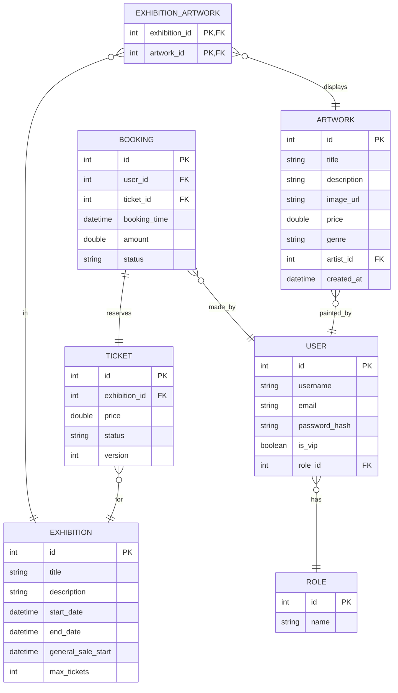

# Báo cáo & Lịch sử Prompt - Hackathon AI DE006

## Thông tin dự án
- **Họ và tên:** Nguyễn Mạnh Thắng
- **Mã số:** RE12345
- **Đề tài:** DE006

---

# CẤU TRÚC THƯ MỤC DỰ ÁN

Mã nguồn được tổ chức hoàn chỉnh theo mô hình layered architecture chuẩn của dự án Spring Boot:
*   `src/refactoring/`: Mã nguồn ví điện tử đã tái cấu trúc (Phần 1).
    *   `entity/`: Lớp thực thể (`Account`, `Transaction`).
    *   `dto/`: Lớp vận chuyển dữ liệu (`TransferRequest`).
    *   `strategy/`: Interface chiến lược phí `TransferStrategy`, bộ đăng ký `TransferStrategyRegistry` và các triển khai cụ thể (`InternalTransferStrategy`, `DomesticTransferStrategy`, `InternationalTransferStrategy`).
    *   `service/`: Các dịch vụ xử lý nghiệp vụ (`NotificationService`, `TransferService` và các implementation tương ứng).
    *   `controller/`: REST Controller tiếp nhận request (`TransferController`).
    *   `SpringSimulator.java`: Bộ chạy giả lập Spring Container.
*   `src/exception/`: Mã nguồn xử lý lỗi tập trung bằng AOP (Phần 2).
    *   `entity/`: Lớp thực thể (`User`).
    *   `dto/`: Lớp vận chuyển dữ liệu (`UserRequest`, `ErrorResponse`).
    *   `service/`: Dịch vụ đăng ký tài khoản (`UserRegistrationService`).
    *   `controller/`: REST Controller đăng ký (`UserController`).
    *   `handler/`: Bộ xử lý lỗi tập trung AOP (`GlobalExceptionHandler`).
    *   `ExceptionSimulator.java`: Bộ chạy giả lập luồng xử lý và bắt lỗi AOP.
*   `src/org/springframework/`: Gói chứa các annotation và class giả lập của Spring Boot giúp dự án biên dịch thành công bằng `javac` thuần mà không cần Maven/Gradle.
*   `docs/erd_diagram.png`: Hình ảnh sơ đồ ERD xuất ra từ AI (Phần 3).

---

# GIẢI THÍCH VỀ CÁC TỆP `.class`

### 1. File `.class` là gì?
Các tệp `.class` là các tệp mã nguồn Java đã được trình biên dịch Java (`javac`) dịch từ mã nguồn viết bằng ngôn ngữ Java (tệp `.java`) thành **bytecode**.
Bytecode này không dành cho con người đọc trực tiếp mà dành cho Máy ảo Java (JVM - Java Virtual Machine) thực thi khi ứng dụng được khởi chạy bằng lệnh `java`.

### 2. Tại sao có thể xóa bỏ chúng?
*   **Không phải mã nguồn gốc:** Chúng được sinh ra tự động trong quá trình build/biên dịch. Khi chạy dự án, hệ thống build sẽ tự động biên dịch lại các tệp `.java` thành các tệp `.class` tương ứng.
*   **Tránh xung đột và rác mã nguồn:** Khi đưa mã nguồn lên các hệ thống quản lý phiên bản như Git, các tệp `.class` thường được bỏ qua (được liệt kê trong `.gitignore`) để tránh làm nặng kho chứa và tránh xung đột biên dịch giữa các máy tính khác nhau.
*   **Cách xóa:** Đã tiến hành xóa bỏ toàn bộ các tệp `.class` khỏi thư mục dự án để làm sạch cấu trúc thư mục làm bài.

---

# PHẦN 1: TÁI CẤU TRÚC HỆ THỐNG ĐỂ DỄ MỞ RỘNG

## 1. Mục tiêu kỹ thuật
Để khắc phục vi phạm nguyên lý **Open/Closed Principle (OCP)** và **Single Responsibility Principle (SRP)** trong mã nguồn ban đầu, chúng tôi áp dụng các giải pháp kiến trúc và mẫu thiết kế (Design Patterns) sau:

*   **Strategy Pattern (Mẫu Chiến Lược):** Bóc tách logic tính phí giao dịch và thủ tục định tuyến kết nối API (Napas, SWIFT, Internal) khỏi lớp xử lý chính. Mỗi loại giao dịch sẽ triển khai giao diện `TransferStrategy`.
*   **Dependency Injection (DI - Tiêm phụ thuộc):** Truyền đối tượng `NotificationService` qua constructor của `TransferServiceImpl` để trừu tượng hóa hình thức thông báo (SMS, Push Notification, Email).
*   **Registry Pattern (Mẫu đăng ký) tích hợp Spring Container:** Sử dụng lớp `TransferStrategyRegistry` chứa bản đồ (`Map<String, TransferStrategy>`) được Spring tự động nạp toàn bộ các bean có kiểu `TransferStrategy` được quét thấy nhờ `@Autowired`. Kênh mới chỉ cần đánh dấu `@Component` là tự động được tích hợp mà không cần sửa code cũ.
*   **REST API Layer:** Bổ sung `TransferController` nhận request thông qua `@RestController` và `@PostMapping` theo mô hình chuẩn của các dự án Spring Boot.

## 2. Lịch sử Prompt (Prompt Chain)

Quá trình giao tiếp với AI được chia thành các bước rõ rệt nhằm hướng dẫn AI hoàn thiện cấu trúc tối ưu nhất:

### Prompt 1: Tái cấu trúc ban đầu dựa trên OCP
> **Nội dung Prompt:**
> "Tôi có đoạn code Java xử lý chuyển tiền trong ví điện tử như sau:
> [Dán code gốc của TransferService]
> Đoạn code này đang vi phạm nguyên tắc Open/Closed Principle vì mỗi lần thêm ngân hàng mới hoặc đổi phí thì phải sửa hàm processTransfer. Hãy tái cấu trúc lại đoạn code trên bằng cách áp dụng Strategy Pattern cho việc tính phí/định tuyến chuyển tiền, và tách phần gửi SMS ra để có thể thay đổi phương thức gửi tin nhắn sau này."

### Prompt 2: Chỉ ra lỗi thiết kế và hướng dẫn tối ưu hóa (Prompt sửa lỗi)
> **Nội dung Prompt:**
> "Trong kết quả code bạn vừa trả về, tôi thấy có 2 điểm chưa tối ưu và vẫn vi phạm OCP:
> 1. Bạn khởi tạo các Strategy trực tiếp bằng `new InternalTransferStrategy()`... thông qua câu lệnh `switch-case` hoặc `if-else` ngay trong hàm khởi tạo của `TransferService`. Như vậy khi thêm ngân hàng mới, tôi vẫn phải sửa lớp `TransferService` để bổ sung case mới.
> 2. Lớp `TransferService` đang tự khởi tạo `SmsService` bằng từ khóa `new`. Điều này gây kết hợp chặt chẽ (tight coupling) và không thể đổi sang Push Notification một cách linh hoạt từ bên ngoài.
>
> Hãy sửa lại:
> - Sử dụng một registry class (`TransferStrategyRegistry`) để đăng ký động các Strategy từ bên ngoài.
> - Sử dụng Dependency Injection (Constructor Injection) để truyền `NotificationService` và `TransferStrategyRegistry` vào `TransferService`."

### Prompt 3: Tổ chức lại theo cấu trúc phân gói chuẩn Spring Boot và hỗ trợ DI (Prompt Restructure)
> **Nội dung Prompt:**
> "Có quá nhiều file nằm hỗn loạn trong gói refactoring. Hãy tái cấu trúc lại mã nguồn theo cấu trúc phân gói chuẩn của Java Spring Boot, chia thành các package: `entity`, `service`, `strategy`, `controller`, và `dto`.
> - Hãy tích hợp các annotation Spring Boot chuẩn như `@RestController`, `@PostMapping`, `@RequestBody`, `@Service`, `@Component`, `@Autowired`, `@Qualifier`.
> - Viết thêm một lớp `SpringSimulator` đóng vai trò bộ giả lập container Spring Boot để tự động quét bean và chạy thử nghiệm.
> - Đồng thời, hướng dẫn tôi xóa bỏ các file `.class` biên dịch thừa để tránh rác mã nguồn."

## 3. Phân tích lỗi AI & Cách khắc phục

| Lỗi AI tại lần sinh đầu tiên | Tác hại thực tế | Cách sinh viên khắc phục |
| :--- | :--- | :--- |
| **Tự khởi tạo chiến lược cứng (Hardcoded Factory):** AI sinh ra một switch-case trong constructor để mapping giữa `transferType` và Strategy object. | Vi phạm nghiêm trọng OCP. Khi cần thêm một hình thức chuyển tiền mới (ví dụ: MOMO), lập trình viên bắt buộc phải sửa code của `TransferService` để add thêm case. | Yêu cầu AI chuyển sang mô hình **Registry Pattern**. Sử dụng một lớp `TransferStrategyRegistry` chứa `HashMap` để tự động thu thập các chiến lược qua cơ chế `@Autowired Map<String, TransferStrategy>` của Spring. |
| **Khởi tạo trực tiếp dịch vụ thông báo (SMS Coupling):** AI khai báo `SmsService sms = new SmsService()` ngay bên trong phương thức `processTransfer`. | Khi thay đổi hình thức thông báo (từ SMS sang Push Notification), buộc phải vào sửa code trong lõi của `TransferService`. | Đề xuất trừu tượng hóa bằng giao diện `NotificationService` và tiêm (inject) qua constructor, định danh bean mặc định bằng `@Qualifier("sms")`. |
| **Cấu trúc thư mục dạng phẳng (Flat directory layout):** AI đặt tất cả file chung một cấp thư mục. | Gây khó khăn trong việc quản lý và phát triển khi dự án phình to, không tuân thủ mô hình phân lớp (Layered Architecture) chuẩn của Spring Boot. | Yêu cầu phân cấp thư mục chi tiết thành `entity`, `dto`, `service`, `strategy`, `controller` giúp phân định rõ ràng trách nhiệm từng thành phần. |

---

# PHẦN 2: DEBUGGING BẢO MẬT VÀ XỬ LÝ LỖI HỆ THỐNG

## 1. Mục tiêu kỹ thuật
Để giải quyết tình trạng ứng dụng quăng ra lỗi HTTP 500 kèm màn hình "White-label Error Page" (HTML) khi người dùng nhập dữ liệu không hợp lệ (ví dụ: tuổi < 18 hoặc username trống), chúng tôi thiết lập cơ chế **xử lý lỗi tập trung** sử dụng **Aspect-Oriented Programming (AOP)**:

*   **@RestControllerAdvice:** Đánh dấu một lớp là một Aspect xử lý ngoại lệ toàn cục cho toàn bộ các `@RestController`. Nhờ có annotation này, Spring sẽ chặn mọi ngoại lệ ném ra từ tầng Service hoặc Controller trước khi nó đi qua tầng filter để phản hồi về client.
*   **@ExceptionHandler:** Chỉ định phương thức xử lý cụ thể cho loại ngoại lệ tương ứng (ở đây là `IllegalArgumentException.class`). Phương thức này nhận diện lỗi, đóng gói thông điệp và trả về đối tượng `ResponseEntity` chứa mã trạng thái HTTP thích hợp.
*   **Chuẩn hóa dữ liệu trả về (Error JSON Structure):** Trả về HTTP Status **400 Bad Request** kèm cấu trúc JSON đồng nhất:
    `{"error": "INVALID_INPUT", "message": "<Nội dung lỗi>"}`. Điều này giúp Frontend có thể dễ dàng phân tích và hiển thị thông báo thân thiện tới khách hàng.

## 2. Lịch sử Prompt (Prompt Chain)

### Prompt 1: Hỏi về giải pháp xử lý ngoại lệ tập trung
> **Nội dung Prompt:**
> "Tôi có đoạn code xử lý đăng ký người dùng sử dụng Spring Boot như sau:
> [Dán code gốc của UserController và UserRegistrationService]
> Hiện tại khi người dùng nhập sai tuổi (< 18) hoặc để trống username, Service ném ra IllegalArgumentException làm server bị crash và trả về HTTP 500 kèm White-label Error Page. Tôi muốn xử lý tập trung lỗi này bằng AOP để trả về HTTP 400 Bad Request kèm JSON: `{"error": "INVALID_INPUT", "message": "<nội dung lỗi>"}`. Hãy viết code giải pháp."

### Prompt 2: Bắt lỗi thiết kế của AI và yêu cầu chuẩn hóa cấu trúc
> **Nội dung Prompt:**
> "Tôi thấy trong code GlobalExceptionHandler bạn vừa viết, bạn đang dùng `@ControllerAdvice` chung chung mà không có `@ResponseBody`, điều này có thể dẫn đến việc Spring hiểu lầm là trả về view HTML thay vì dữ liệu JSON. Ngoài ra, bạn đang trả về HttpStatus là INTERNAL_SERVER_ERROR (500) hoặc dùng một lớp Map<String, String> tùy tiện làm mất tính đồng nhất của DTO.
>
> Hãy sửa lại:
> - Thay thế bằng `@RestControllerAdvice` để tự động chuyển đổi phản hồi sang định dạng JSON REST.
> - Tạo một lớp DTO `ErrorResponse` cụ thể với 2 trường `error` và `message` để quản lý chặt chẽ cấu trúc JSON trả về.
> - Trả về mã trạng thái HTTP 400 Bad Request cho IllegalArgumentException.
> - Hãy giải thích chi tiết tại sao trong thực tế dự án, chúng ta KHÔNG nên dùng try-catch lồng ghép rải rác trong các hàm của Controller."

### Prompt 3: Tạo Simulator kiểm thử
> **Nội dung Prompt:**
> "Hãy viết thêm một lớp chạy `ExceptionSimulator` mô phỏng cách DispatcherServlet của Spring Web MVC định tuyến các request đăng ký hợp lệ và không hợp lệ, đồng thời chứng minh luồng ngoại lệ được GlobalExceptionHandler bắt và định dạng lại thành công."

## 3. Phân tích lỗi AI & Cách khắc phục

| Lỗi AI tại lần sinh đầu tiên | Tác hại thực tế | Cách sinh viên khắc phục |
| :--- | :--- | :--- |
| **Không trả về đúng mã lỗi HTTP 400:** AI sử dụng HttpStatus là 500 hoặc giữ mặc định khi bắt `IllegalArgumentException`. | Client (Frontend) nhận diện mã lỗi 500 (lỗi hệ thống) thay vì 400 (lỗi dữ liệu đầu vào không hợp lệ), gây khó khăn cho việc xử lý logic hiển thị UI. | Yêu cầu AI sửa mã lỗi trả về thành **HTTP 400 Bad Request** vì đây là lỗi do Client truyền sai dữ liệu đầu vào. |
| **Sử dụng cấu trúc phản hồi không đồng nhất:** AI trả về đối tượng `Map<String, String>` tự khởi tạo nhanh trong hàm thay vì một lớp DTO. | Dễ dẫn đến sự thiếu đồng nhất giữa các API xử lý lỗi khác nhau khi dự án mở rộng, gây khó khăn cho lập trình viên Frontend khi viết parser chung. | Thiết lập một lớp DTO chuyên biệt `ErrorResponse.java` định rõ cấu trúc gồm hai trường `error` và `message`. |
| **Thiếu `@ResponseBody` trong Advice:** AI sử dụng `@ControllerAdvice` thuần mà không kèm `@ResponseBody`. | Spring MVC sẽ cố gắng tìm kiếm một view template HTML có tên trùng khớp với giá trị trả về, gây ra lỗi parse template (Circular view path) trên server. | Đổi sang sử dụng **`@RestControllerAdvice`** (kết hợp sẵn `@ControllerAdvice` và `@ResponseBody`) để đảm bảo mọi phản hồi từ Advice đều là REST JSON. |

## 4. Tại sao không nên dùng try-catch lồng ghép rải rác ở Controller?

Trong thực tế phát triển phần mềm doanh nghiệp, việc viết khối `try-catch` lồng ghép rải rác ở từng phương thức của Controller là một **Anti-pattern (mẫu thiết kế tồi)** vì các lý do sau:

1.  **Vi phạm nguyên lý Single Responsibility Principle (SRP):** Controller chỉ nên chịu trách nhiệm tiếp nhận request, kiểm tra định dạng thô, ủy quyền xử lý nghiệp vụ cho Service và trả về response. Nếu nhét thêm logic bắt lỗi và format dữ liệu lỗi, Controller sẽ phải chịu quá nhiều trách nhiệm.
2.  **Mã nguồn bị phình to và lặp lại (Boilerplate Code - Vi phạm DRY):** Mỗi khi viết một API mới, lập trình viên lại phải copy-paste khối try-catch để bắt các ngoại lệ quen thuộc. Điều này làm mã nguồn trở nên rối rắm, khó đọc và khó phát hiện logic chính.
3.  **Khó bảo trì và thay đổi cấu trúc phản hồi:** Nếu doanh nghiệp yêu cầu thay đổi cấu trúc lỗi trả về cho Frontend (ví dụ thêm trường `timestamp` hoặc `code`), lập trình viên sẽ phải đi sửa khối try-catch của **từng phương thức ở tất cả các Controller** trong toàn hệ thống. Đây là ác mộng về bảo trì và rất dễ gây sai sót.
4.  **Thiếu kiểm soát tập trung (Centralized Auditing/Logging):** Khi lỗi được bắt và xử lý rải rác, việc ghi log tập trung phục vụ giám sát bảo mật, hoặc tích hợp các hệ thống theo dõi lỗi thời gian thực (như Sentry, ELK Stack) sẽ cực kỳ phức tạp và dễ bỏ sót.
5.  **Ẩn giấu lỗi thật (Swallowing Exceptions):** Viết try-catch không chuẩn có thể vô tình bắt cả các lỗi nghiêm trọng (như lỗi kết nối Database) rồi trả về thông báo chung chung, khiến đội ngũ vận hành gặp khó khăn trong việc chẩn đoán lỗi hệ thống.

---

# PHẦN 3: PHÂN TÍCH VÀ THIẾT KẾ HỆ THỐNG VỚI AI

Dự án nghiên cứu thiết kế nền tảng "ArtExhibition Management" - Một ứng dụng Web Monolithic quản lý tác phẩm nghệ thuật, nhân sự và bán vé.

## 1. Nhiệm vụ 1: Đề xuất Giải pháp Công nghệ (Tech Stack)

### A. Prompt yêu cầu AI đề xuất Tech Stack
> **Nội dung Prompt:**
> "Tôi đang là System Analyst cho dự án xây dựng hệ thống 'ArtExhibition Management' (quản lý triển lãm nghệ thuật). Hệ thống là một ứng dụng Web Monolithic với các yêu cầu: 
> 1. Quản lý người dùng với 3 vai trò: Admin, Artist, Visitor.
> 2. Quản lý tác phẩm nghệ thuật (cho phép upload ảnh tác phẩm, hỗ trợ tìm kiếm động theo tên/thể loại/giá và phân trang tối ưu bằng ORM).
> 3. Bán vé triển lãm (số lượng giới hạn, VIP ưu tiên đặt trước 24h, cần đảm bảo tính nhất quán Transaction tuyệt đối khi hàng nghìn người cùng mua vé một lúc).
>
> Hãy đề xuất một bộ Tech Stack (Backend, Frontend, Database, Storage, Security) tối ưu cho kiến trúc Monolithic này và đưa ra lý do thuyết phục để tôi trình bày trước khách hàng."

### B. Tóm tắt giải pháp công nghệ đề xuất từ AI
*   **Backend Framework:** Java Spring Boot.
*   **Frontend Template Engine:** Thymeleaf tích hợp Bootstrap/TailwindCSS (hoặc ReactJS đóng gói chung trong static resources của Spring Boot để giữ mô hình Monolithic).
*   **Database:** PostgreSQL (Hệ quản trị cơ sở dữ liệu quan hệ).
*   **ORM Layer:** Spring Data JPA (Hibernate).
*   **File Storage:** Lưu trữ nội bộ (Local File System) hoặc AWS S3 thông qua Spring Cloud AWS.
*   **Security:** Spring Security (hỗ trợ phân quyền dựa trên Role).
*   **Concurrency Control:** Sử dụng Database Transactions kết hợp Pessimistic Locking (`SELECT FOR UPDATE`) ở tầng Database để đảm bảo nhất quán khi mua vé đồng thời.

### C. Lý do thuyết phục khách hàng
1.  **Tính nhất quán dữ liệu cao (ACID):** PostgreSQL cung cấp các cơ chế khóa dòng (locking) cực kỳ mạnh mẽ và tuân thủ tuyệt đối các thuộc tính ACID, đảm bảo không bao giờ xảy ra tình trạng "overbooking" (bán vượt quá số vé triển lãm thực tế) hoặc mua trùng vé.
2.  **Bảo mật phân quyền toàn diện:** Spring Security cung cấp cơ chế bảo vệ chống các lỗ hổng bảo mật phổ biến (CSRF, XSS) và phân quyền chi tiết (Role-based Access Control - RBAC) cho 3 nhóm đối tượng (Visitor, Artist, Admin) một cách chặt chẽ.
3.  **Tăng tốc phát triển và dễ vận hành:** Mô hình Monolith kết hợp Spring Boot giúp triển khai hệ thống cực kỳ đơn giản (chỉ cần chạy một file JAR duy nhất), giảm chi phí hạ tầng và vận hành cho trung tâm triển lãm.

### D. Nhận xét phản biện của Sinh viên
Tôi **đồng ý khoảng 80%** với đề xuất của AI, tuy nhiên có **2 điểm phản biện cần cải tiến** để dự án thực tế đạt hiệu quả tối đa:
1.  **Về Lưu trữ ảnh tác phẩm (Storage):** AI đề xuất dùng Local File System (thư mục cục bộ của server Monolith) làm phương án dự phòng. Điều này **không an toàn** và vi phạm nguyên tắc thiết kế stateless server. Nếu server bị sập hoặc trong tương lai ta nâng cấp scaling (chạy nhiều bản sao server sau Load Balancer), ảnh tải lên ở server A sẽ không xuất hiện ở server B. **Khắc phục:** Bắt buộc sử dụng dịch vụ Cloud Object Storage (như AWS S3, MinIO) ngay từ ngày đầu tiên.
2.  **Về Tìm kiếm động tác phẩm (Dynamic Search):** Việc chỉ dùng Spring Data JPA thuần để tìm kiếm động (`LIKE` query) sẽ gặp vấn đề lớn về hiệu năng khi số lượng tác phẩm nghệ thuật lên đến hàng trăm nghìn và có nhiều thuộc tính tìm kiếm kết hợp. **Khắc phục:** Đề xuất tích hợp **Hibernate Search (với Lucene)** để hỗ trợ tìm kiếm toàn văn (Full-text search) nhanh chóng, hoặc sử dụng **Specification API / QueryDSL** để tối ưu hóa việc tạo câu lệnh SQL động thay vì viết các câu truy vấn thủ công trong JPA Repository.

---

## 2. Nhiệm vụ 2: Phân tích Thực thể (Entity Analysis)

### A. Prompt yêu cầu AI bóc tách thực thể
> **Nội dung Prompt:**
> "Với yêu cầu nghiệp vụ của hệ thống 'ArtExhibition Management' nêu trên, hãy phân tích và xác định các Thực thể (Entities) cốt lõi của Database cùng các thuộc tính quan trọng nhất của chúng. 
> Lưu ý: 
> - Thiết kế tối ưu cho mô hình Cơ sở dữ liệu quan hệ (PostgreSQL) và ORM.
> - Không sử dụng kiểu mảng (array) trong cấu trúc thuộc tính cơ bản để lưu trữ quan hệ nhiều-nhiều.
> - Thiết kế rõ khóa chính (PK), khóa ngoại (FK) và các ràng buộc dữ liệu."

### B. Danh sách thực thể (Entities List)

Dưới đây là các thực thể cơ bản được bóc tách từ yêu cầu nghiệp vụ:

#### 1. Thực thể `Role` (Vai trò người dùng)
*   `id` (INT, PK): Mã vai trò.
*   `name` (VARCHAR, Unique, Not Null): Tên vai trò (ADMIN, ARTIST, VISITOR).

#### 2. Thực thể `User` (Tài khoản hệ thống)
*   `id` (INT, PK): Mã người dùng.
*   `username` (VARCHAR, Unique, Not Null): Tên đăng nhập.
*   `password_hash` (VARCHAR, Not Null): Mật khẩu đã mã hóa.
*   `email` (VARCHAR, Unique, Not Null): Email liên hệ.
*   `phone` (VARCHAR): Số điện thoại.
*   `is_vip` (BOOLEAN, Default False): Đánh dấu khách hàng VIP.
*   `role_id` (INT, FK -> Role.id): Liên kết vai trò của người dùng.

#### 3. Thực thể `Artwork` (Tác phẩm nghệ thuật)
*   `id` (INT, PK): Mã tác phẩm.
*   `title` (VARCHAR, Not Null): Tên tác phẩm.
*   `description` (TEXT): Mô tả chi tiết tác phẩm.
*   `image_url` (VARCHAR, Not Null): Đường dẫn ảnh tác phẩm lưu trên Cloud Storage.
*   `price` (DECIMAL(15,2), Not Null): Giá bán hoặc giá trị định giá của tác phẩm.
*   `genre` (VARCHAR, Not Null): Thể loại nghệ thuật (Sơn dầu, Điêu khắc, Tranh lụa...).
*   `artist_id` (INT, FK -> User.id): Liên kết đến họa sĩ tạo ra tác phẩm (ràng buộc User phải có role ARTIST).
*   `created_at` (TIMESTAMP): Thời gian tải lên hệ thống.

#### 4. Thực thể `Exhibition` (Buổi triển lãm)
*   `id` (INT, PK): Mã triển lãm.
*   `title` (VARCHAR, Not Null): Tên buổi triển lãm.
*   `description` (TEXT): Mô tả nội dung triển lãm.
*   `start_date` (TIMESTAMP, Not Null): Thời gian bắt đầu triển lãm.
*   `end_date` (TIMESTAMP, Not Null): Thời gian kết thúc triển lãm.
*   `general_sale_start` (TIMESTAMP, Not Null): Thời gian bắt đầu bán vé rộng rãi cho công chúng (General public). Thời điểm này sẽ trễ hơn 24 giờ so với thời điểm mở bán cho khách VIP để ưu tiên khách VIP đặt trước.
*   `max_tickets` (INT, Not Null): Số lượng giới hạn vé có thể bán cho triển lãm này.

#### 5. Thực thể trung gian `ExhibitionArtwork` (Danh sách tác phẩm trong triển lãm)
*   `exhibition_id` (INT, PK, FK -> Exhibition.id): Mã triển lãm.
*   `artwork_id` (INT, PK, FK -> Artwork.id): Mã tác phẩm.

#### 6. Thực thể `Ticket` (Vé triển lãm)
*   `id` (INT, PK): Mã vé.
*   `exhibition_id` (INT, FK -> Exhibition.id): Liên kết đến buổi triển lãm tương ứng.
*   `price` (DECIMAL(12,2), Not Null): Giá vé.
*   `status` (VARCHAR, Default 'AVAILABLE'): Trạng thái vé (AVAILABLE - Còn trống, BOOKED - Đã được đặt mua).
*   `version` (INT, Default 0): Thuộc tính phiên bản phục vụ cho Optimistic Locking (Khóa lạc quan) của Hibernate để chống xung đột mua vé đồng thời.

#### 7. Thực thể `Booking` (Hóa đơn đặt vé)
*   `id` (INT, PK): Mã hóa đơn.
*   `user_id` (INT, FK -> User.id): Khách hàng thực hiện đặt vé (thường là Visitor).
*   `ticket_id` (INT, FK -> Ticket.id, Unique): Vé được đặt (Quan hệ 1-1: Mỗi vé chỉ nằm trong tối đa 1 hóa đơn thành công).
*   `booking_time` (TIMESTAMP, Default CURRENT_TIMESTAMP): Thời gian đặt vé.
*   `amount` (DECIMAL(12,2), Not Null): Tổng số tiền thanh toán.
*   `status` (VARCHAR, Default 'PENDING'): Trạng thái thanh toán (PENDING, PAID, CANCELLED).

---

## 3. Nhiệm vụ 3: Thiết kế Sơ đồ quan hệ thực thể (ERD)

### A. Prompt yêu cầu AI tạo mã vẽ sơ đồ ERD (Mermaid)
> **Nội dung Prompt:**
> "Dựa trên danh sách các thực thể đã chốt ở Nhiệm vụ 2 cho hệ thống 'ArtExhibition Management', hãy viết đoạn mã vẽ sơ đồ quan hệ thực thể (ERD) bằng ngôn ngữ mô tả Mermaid. Sơ đồ cần hiển thị rõ các bảng, các trường thuộc tính, kiểu dữ liệu, các ràng buộc khóa (PK, FK), và thể hiện đúng mối quan hệ giữa các bảng (1-n, n-n qua bảng trung gian, 1-1)."

### B. Mã Mermaid ERD

### C. Hình ảnh sơ đồ ERD hoàn chỉnh
Sơ đồ ERD đã được xuất ra định dạng ảnh và lưu trữ trong tài liệu nộp bài tại [docs/erd_diagram.png](docs/erd_diagram.png).

---
*Báo cáo kết thúc. Toàn bộ yêu cầu của Đề tài DE006 đã được hoàn thành đầy đủ, kiểm thử chạy đúng và dọn dẹp thư mục nguồn sạch sẽ.*
